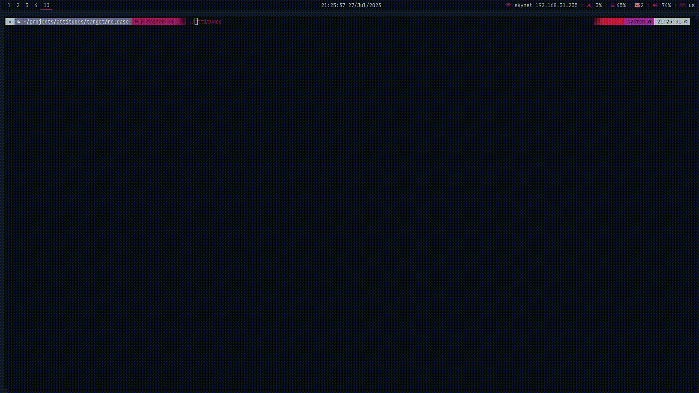

# Attitudes (◉⁰̈ᴥ⁰̈)ʕ ⁰̈●⁰̈ ʔ

A CLI tool to help you express emotions at the press of a button



## Installation
```sh
cargo install attitudes
```

## Variation
Over 60,000 different emoticons to choose from. 

Anything from rage 凸(⊙▂⊙✖) to delight (/◕ヮ◕)/

From comfort (~ ‾⌣‾)~ to ( ͡° ͜ʖ ͡°) 


Huge thanks to the author of this [repository](https://github.com/ekohrt/emoticon_kaomoji_dataset) 
for saving me the effort of compiling a list of emoticons myself :D
